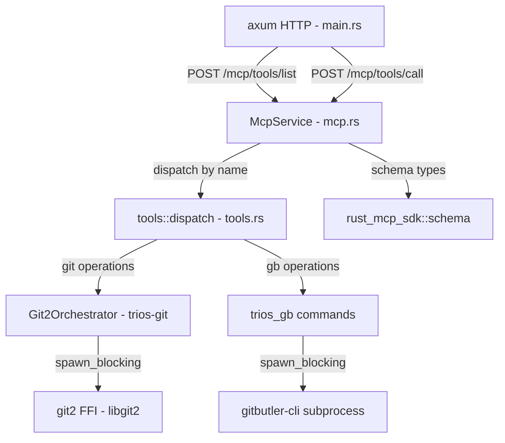
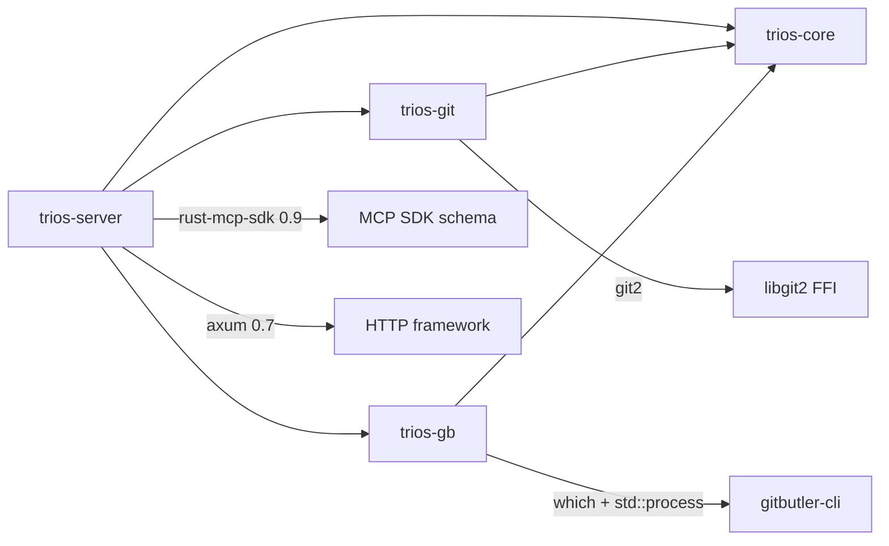

# trios-server Architectural Audit

**Date:** 2025-04-18  
**Scope:** Full codebase — `trios-server`, `trios-core`, `trios-git`, `trios-gb`

---

## 1. Executive Summary

The trios workspace is a Rust MCP (Model Context Protocol) server that exposes Git operations as tools over HTTP via `axum`. The architecture follows a clean layered pattern:

```
axum HTTP handlers  →  McpService  →  tools::dispatch  →  Git2Orchestrator / trios_gb
```

The codebase is small and well-structured, but has several **critical** and **high** severity issues around error handling, security, observability, and SDK integration strategy that should be addressed before production use.

---

## 2. Architecture Overview



### Crate Dependency Graph



---

## 3. Findings by Severity

### CRITICAL

#### C1: Path Traversal Vulnerability in `tools::dispatch`

**File:** [`tools.rs`](../crates/trios-server/src/tools.rs:8)

The `repo_path` parameter is taken directly from user input and passed to `git2::Repository::open()` without any validation. An attacker can supply any filesystem path:

```rust
let repo_path = input.get("repo_path").and_then(|v| v.as_str())?;
let repo = Path::new(repo_path);
```

**Risk:** Arbitrary repository access, potential information disclosure.

**Recommendation:**
- Add a configurable allowlist of permitted repository root directories
- Validate that `repo_path` is absolute and canonicalized
- Reject paths containing `..` components or symlinks outside allowed roots
- Consider a middleware or guard that validates repo_path before dispatch

#### C2: No Authentication or Authorization on HTTP Endpoints

**File:** [`main.rs`](../crates/trios-server/src/main.rs:22)

All endpoints — including destructive operations like `git_commit` and `git_create_branch` — are publicly accessible with zero auth:

```rust
.route("/mcp/tools/call", post(call_mcp_tool))
```

**Risk:** Anyone with network access can execute Git operations on the host.

**Recommendation:**
- Add Bearer token or API key authentication via axum middleware
- Bind to `127.0.0.1` instead of `0.0.0.0` by default (or make it configurable)
- Consider rate limiting for brute-force protection

---

### HIGH

#### H1: `rust-mcp-sdk` Used Only for Schema Types — SDK Features Wasted

**File:** [`Cargo.toml`](../crates/trios-server/Cargo.toml:26)

The dependency `rust-mcp-sdk = "0.9"` with features `["server", "hyper-server"]` is declared, but the code only uses schema types (`Tool`, `CallToolResult`, etc.). The SDK provides a full MCP server runtime with stdio/SSE/StreamableHTTP transports, but `trios-server` reimplements HTTP handling manually with axum.

**Impact:** Unnecessary dependency bloat, missed protocol compliance, and maintenance burden.

**Recommendation — choose one path:**

- **Option A (Recommended):** Use the SDK's `hyper-server` feature and `ServerHandler` trait. This gives you protocol-compliant MCP transport (JSON-RPC, initialization handshake, pagination, etc.) for free. Remove the manual axum routes for MCP.
- **Option B:** Drop `rust-mcp-sdk` entirely and depend only on `rust-mcp-schema` for the type definitions. This removes ~50 transitive deps.

#### H2: `unwrap()` on JSON Object Construction in `mcp.rs`

**File:** [`mcp.rs`](../crates/trios-server/src/mcp.rs:28)

Multiple `.as_object().unwrap().clone()` calls for building tool schemas:

```rust
json!({"type": "string"}).as_object().unwrap().clone(),
```

While `json!` macro always produces the expected type here, this pattern is fragile and noisy. A single incorrect JSON literal would panic at runtime.

**Recommendation:** Use a helper function or construct `serde_json::Map` directly:

```rust
fn prop_type(type_str: &str) -> serde_json::Map<String, Value> {
    let mut m = serde_json::Map::new();
    m.insert("type".into(), Value::String(type_str.into()));
    m
}
```

#### H3: `tools::dispatch` Creates a New `Git2Orchestrator` Per Call

**File:** [`tools.rs`](../crates/trios-server/src/tools.rs:13)

```rust
let git = Git2Orchestrator;
```

While `Git2Orchestrator` is a zero-sized unit struct, this pattern means every tool call independently opens a `git2::Repository`. There is no connection pooling, caching, or coordination.

**Recommendation:** For now this is acceptable since `git2::Repository` is cheap to open. However, if you add caching or repo-level state in the future, consider injecting a shared repository handle or connection pool through `McpService`.

#### H4: `spawn_blocking` Tasks Are Unbounded

**File:** [`trios-git/src/lib.rs`](../crates/trios-git/src/lib.rs:23)

Every Git operation spawns a `tokio::task::spawn_blocking` call. Under high concurrency, this can exhaust the blocking thread pool (default 512 threads), causing latency spikes or deadlocks.

**Recommendation:**
- Add a semaphore or use `tokio::task::block_in_place` with care
- Set a custom blocking thread pool size via `tokio::runtime::Builder::max_blocking_threads`
- Consider a bounded channel/queue pattern for Git operations

---

### MEDIUM

#### M1: No Request Validation or Input Sanitization

**File:** [`tools.rs`](../crates/trios-server/src/tools.rs:7)

The `dispatch` function extracts string parameters but never validates them:
- `repo_path` — no existence check, no canonicalization
- `message` — no length limit, no encoding validation
- `paths` — no path traversal check within the repo
- `branch_name` — no validation against Git naming rules

**Recommendation:** Add a validation layer:
- Check `repo_path.exists()` and `repo_path.is_dir()`
- Limit `message` length (e.g., 4096 chars)
- Validate branch names against Git rules (no spaces, no `..`, etc.)
- Sanitize file paths within the repo

#### M2: No Graceful Shutdown

**File:** [`main.rs`](../crates/trios-server/src/main.rs:36)

```rust
axum::serve(listener, app).await?;
```

There is no signal handling. A `SIGTERM` or `Ctrl+C` will abort in-flight requests.

**Recommendation:** Use `axum::serve` with `tokio::signal`:

```rust
axum::serve(listener, app)
    .with_graceful_shutdown(shutdown_signal())
    .await?;
```

#### M3: No Request Timeout or Concurrency Limit

**File:** [`main.rs`](../crates/trios-server/src/main.rs:22)

No axum middleware layers for:
- Request body size limits
- Request timeouts
- Concurrency limits

A single large request or many concurrent requests could exhaust resources.

**Recommendation:** Add axum middleware tower layers:
- `tower::limit::ConcurrencyLimitLayer`
- `tower::timeout::TimeoutLayer`
- `axum::extract::DefaultBodyLimit`

#### M4: `list_mcp_tools` Endpoint Uses POST Instead of GET

**File:** [`main.rs`](../crates/trios-server/src/main.rs:25)

```rust
.route("/mcp/tools/list", post(list_mcp_tools))
```

Listing tools is a read-only, idempotent operation. It should use GET. The MCP spec itself uses JSON-RPC (POST), but since this is a custom REST wrapper, RESTful conventions should apply.

**Recommendation:** Change to `get(list_mcp_tools)` or align with MCP JSON-RPC spec properly.

#### M5: Unused Dependencies in `Cargo.toml`

**File:** [`trios-server/Cargo.toml`](../crates/trios-server/Cargo.toml:26)

- `rust-mcp-sdk` features `["server", "hyper-server"]` are declared but unused (only schema types are used)
- `base64` and `image` are declared but never imported in any source file
- `which = "6"` is a direct dependency but only used by `trios-gb`

**Recommendation:**
- Remove `base64` and `image` or add a `vision` feature gate
- Change `rust-mcp-sdk` to `default-features = false` or switch to `rust-mcp-schema`
- Move `which` to only `trios-gb`'s Cargo.toml

---

### LOW

#### L1: `McpService` Is a Zero-Sized Unit Struct

**File:** [`mcp.rs`](../crates/trios-server/src/mcp.rs:11)

```rust
#[derive(Clone)]
pub struct McpService;
```

This is used as axum state, which requires `Clone`. A ZST is fine here, but if you ever add state (e.g., config, repo allowlist, metrics), you will need `Arc<...>` wrapping.

**Recommendation:** Consider defining it as `Arc<McpServiceInner>` from the start to avoid a breaking refactor later.

#### L2: `tool_definitions()` Rebuilds on Every Call

**File:** [`mcp.rs`](../crates/trios-server/src/mcp.rs:18)

`list_tools()` calls `Self::tool_definitions()` which allocates a new `Vec<Tool>` every time. This is called on every HTTP request.

**Recommendation:** Use `lazy_static!` or `std::sync::LazyLock` to build tool definitions once.

#### L3: Inconsistent Error Handling Patterns

**Files:** [`mcp.rs`](../crates/trios-server/src/mcp.rs:172), [`tools.rs`](../crates/trios-server/src/tools.rs:72)

- `mcp.rs` catches errors and wraps them in `CallToolResult { is_error: Some(true) }` — good
- `tools.rs` uses `anyhow::bail!` for unknown tools — good
- But `trios-gb` silently swallows errors with `unwrap_or_default()` — inconsistent

**Recommendation:** Establish a consistent error taxonomy. Consider a custom error enum instead of `anyhow` for the server layer, while keeping `anyhow` for internal crates.

#### L4: No Structured Logging or Metrics

**File:** [`main.rs`](../crates/trios-server/src/main.rs:9)

Only `tracing::info!` is used. No structured fields, no request IDs, no latency metrics.

**Recommendation:**
- Add `tracing::info!(tool = %params.name, "calling tool")` with structured fields
- Add request ID middleware via axum
- Consider `metrics` crate for Prometheus-compatible metrics

#### L5: No Health Check for Dependencies

**File:** [`main.rs`](../crates/trios-server/src/main.rs:40)

The `/health` endpoint always returns `ok` without checking if Git or GitButler CLI are functional.

**Recommendation:** Add optional dependency checks to the health endpoint:
- Check if `git` is available
- Check if `gitbutler-cli` is available (optional)
- Report SDK version compatibility

---

## 4. Thread Safety Analysis

| Component | Thread Safety | Notes |
|-----------|--------------|-------|
| `McpService` | ✅ Safe | ZST, no mutable state |
| `Git2Orchestrator` | ✅ Safe | ZST, each call opens its own `Repository` |
| `git2::Repository` | ✅ Safe | Created per-call inside `spawn_blocking` |
| `trios_gb` commands | ✅ Safe | Each call spawns its own subprocess |
| `axum::Router` | ✅ Safe | Axum handles concurrency internally |

**Verdict:** No thread safety issues currently. The stateless design avoids shared mutable state entirely.

**Warning:** If you add caching, connection pooling, or in-memory state in the future, you must use `Arc<Mutex<...>>` or `Arc<RwLock<...>>` and be mindful of lock ordering.

---

## 5. Async Safety Analysis

| Pattern | Status | Notes |
|---------|--------|-------|
| `spawn_blocking` for git2 | ✅ Correct | Blocking FFI calls offloaded properly |
| `spawn_blocking` for subprocess | ✅ Correct | `std::process::Command` is blocking |
| `async_trait` on `GitOrchestrator` | ✅ Correct | Properly implemented |
| No `async` in `McpService::list_tools` | ✅ Correct | Sync operation, no fake async |

**Concern:** The `CommitResult.files_committed` field uses `index.len()` AFTER `write_tree()` and `commit()`, which means it reports the total index entries, not just the files in the commit. This is a logic bug.

---

## 6. Recommended Action Plan

### Phase 1 — Security Hardening

1. **Add path validation** for `repo_path` parameter (allowlist + canonicalization)
2. **Add authentication middleware** (Bearer token or API key)
3. **Bind to localhost by default** — make bind address configurable
4. **Add request body size limits** and timeouts via tower middleware

### Phase 2 — SDK Integration Cleanup

5. **Decide on SDK strategy** — use it fully or drop to schema-only
6. **Remove unused dependencies** (`base64`, `image`, unused SDK features)
7. **Add `rust-mcp-schema` directly** if dropping SDK runtime

### Phase 3 — Reliability

8. **Add graceful shutdown** with signal handling
9. **Add concurrency limits** for `spawn_blocking` tasks
10. **Fix `files_committed` count** in `commit.rs`
11. **Add input validation** for all tool parameters

### Phase 4 — Observability & Maintainability

12. **Add structured logging** with request IDs
13. **Cache tool definitions** with `LazyLock`
14. **Add integration tests** for HTTP endpoints
15. **Add OpenAPI/JSON-RPC schema documentation**

---

## 7. Dependency Audit

| Crate | Version | Used | Notes |
|-------|---------|------|-------|
| `axum` | 0.7 | ✅ | HTTP framework |
| `tokio` | 1 | ✅ | Async runtime |
| `serde` / `serde_json` | 1 | ✅ | Serialization |
| `anyhow` | 1 | ✅ | Error handling |
| `tracing` / `tracing-subscriber` | 0.1/0.3 | ✅ | Logging |
| `rust-mcp-sdk` | 0.9 | ⚠️ | Only schema types used |
| `git2` | 0.19 | ✅ | Git operations (via trios-git) |
| `async-trait` | 0.1 | ✅ | Trait async methods |
| `which` | 6 | ⚠️ | Only used in trios-gb |
| `base64` | 0.22 | ❌ | Unused |
| `image` | 0.25 | ❌ | Unused |
