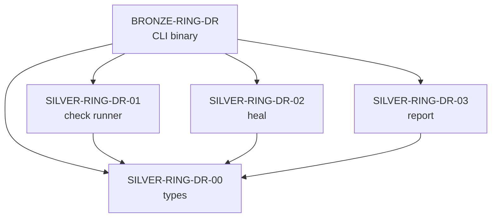

# Plan: trios-doctor Ring Architecture (Issue #254)

## Status: DELTA agent — ready for deployment

## Current State

The ring scaffolding **already exists** with `Cargo.toml`, `src/lib.rs`, `RING.md`, `AGENTS.md`, `TASK.md` in each ring.
The code is partially migrated from the monolith `crates/trios-doctor/src/`. However:

- Rings are **NOT registered** in root `Cargo.toml` workspace members
- The old monolith `src/` still exists (violates L-ARCH-001)
- Open tasks remain in each ring's TASK.md

## Architecture



### 7 Checks Per Ring

```
trios-doctor check  →  each ring gets 7 checks:

  cargo check  →  🔴 Red    - won't compile
  cargo clippy →  🟡 Yellow - warnings
  cargo test   →  🟡 Yellow - tests fail
  cargo fmt    →  🟡 Yellow - formatting issues
  RING.md      →  🟡 Yellow - doc missing
  AGENTS.md    →  🟡 Yellow - doc missing
  TASK.md      →  🟡 Yellow - doc missing
```

## Implementation Steps

### Step 1: Register Rings in Workspace

**File:** `Cargo.toml` (root)

Add to `members`:
```toml
# trios-doctor — Ring Architecture (issue #254)
"crates/trios-doctor/rings/SILVER-RING-DR-00",
"crates/trios-doctor/rings/SILVER-RING-DR-01",
"crates/trios-doctor/rings/SILVER-RING-DR-02",
"crates/trios-doctor/rings/SILVER-RING-DR-03",
"crates/trios-doctor/rings/BRONZE-RING-DR",
```

Add to `exclude`:
```toml
"crates/trios-doctor",
```

Remove from `members`:
```toml
"crates/trios-doctor",   # ← remove this line
```

### Step 2: DR-01 — Check Runner Enhancement

**File:** `crates/trios-doctor/rings/SILVER-RING-DR-01/src/lib.rs`

Current: `workspace_check()`, `workspace_test()`, `workspace_clippy()` (workspace-level)

Add per-crate granularity:

```rust
// New methods on Doctor
pub fn check_crate(&self, crate_path: &Path) -> WorkspaceCheck
pub fn clippy_crate(&self, crate_path: &Path) -> WorkspaceCheck  
pub fn test_crate(&self, crate_path: &Path) -> WorkspaceCheck
pub fn check_fmt(&self) -> WorkspaceCheck                    // cargo fmt --check --workspace
pub fn check_ring_docs(&self, crate_path: &Path) -> WorkspaceCheck  // RING.md/AGENTS.md/TASK.md
pub fn ring_structure_check(&self) -> WorkspaceCheck         // L-ARCH-001: no src/ at crate root
```

`check_ring_docs` verifies for each ring directory:
- `RING.md` exists and non-empty
- `AGENTS.md` exists and non-empty
- `TASK.md` exists and non-empty

### Step 3: DR-02 — Heal Implementation

**File:** `crates/trios-doctor/rings/SILVER-RING-DR-02/src/lib.rs`

Current: stub `Healer` with dry_run only

Implement:

```rust
impl Healer {
    pub fn heal_crate(&self, check: &WorkspaceCheck) -> HealResultEntry
    // cargo fix --allow-dirty --allow-staged for Yellow clippy
    // cargo fmt for Yellow fmt
    // Create missing RING.md / AGENTS.md / TASK.md templates
}
```

Rules:
- **Green** → skip
- **Yellow** → auto-fix (cargo fix, cargo fmt, create docs)
- **Red** → skip (manual fix required), add to `failed` list

Add `tempfile` to dev-dependencies for tests.

### Step 4: DR-03 — Report Enhancement

**File:** `crates/trios-doctor/rings/SILVER-RING-DR-03/src/lib.rs`

Current: `print_text()`, `print_json()`, `summary_line()`

Add:

```rust
impl Reporter {
    pub fn report_human(diagnosis: &WorkspaceDiagnosis) -> String   // ANSI colors
    pub fn report_json(diagnosis: &WorkspaceDiagnosis) -> String    // pretty JSON
    pub fn overall_status(diagnosis: &WorkspaceDiagnosis) -> CheckStatus
    pub fn report_sarif(diagnosis: &WorkspaceDiagnosis) -> String   // SARIF format
    pub fn report_github(diagnosis: &WorkspaceDiagnosis) -> String  // ::error / ::warning
}
```

ANSI color codes (no external dep):
- Green = `\x1b[32m`
- Yellow = `\x1b[33m`
- Red = `\x1b[31m`
- Reset = `\x1b[0m`

### Step 5: BRONZE-RING-DR — CLI with clap

**File:** `crates/trios-doctor/rings/BRONZE-RING-DR/Cargo.toml`

Add dependency:
```toml
clap = { workspace = true }
```

**File:** `crates/trios-doctor/rings/BRONZE-RING-DR/src/main.rs`

```rust
#[derive(Parser)]
#[command(name = "trios-doctor")]
enum Cli {
    Check {
        #[arg(long)] json: bool,
        #[arg(long)] sarif: bool,
        #[arg(long)] github: bool,
    },
    Heal {
        #[arg(long)] dry_run: bool,  // default: true
    },
    Report {
        #[arg(long)] json: bool,
    },
}
```

Subcommands:
- `trios-doctor check` — run DR-01 checks, output via DR-03
- `trios-doctor check --json` — JSON output
- `trios-doctor check --sarif` — SARIF for GitHub
- `trios-doctor heal` — run DR-02 heal (dry_run by default)
- `trios-doctor heal --dry-run=false` — actually apply fixes
- `trios-doctor report` — full report

### Step 6: Remove Monolith src/

Per L-ARCH-001: **NO `src/` at crate root. NO files outside `rings/`.**

Delete:
- `crates/trios-doctor/src/lib.rs`
- `crates/trios-doctor/src/main.rs`
- `crates/trios-doctor/src/check.rs`
- `crates/trios-doctor/src/heal.rs`
- `crates/trios-doctor/src/report.rs`
- `crates/trios-doctor/src/validate_bpb.rs`
- `crates/trios-doctor/src/` (directory)

Keep:
- `crates/trios-doctor/Cargo.toml` — but strip `[lib]` and `[[bin]]` sections, make it a placeholder
- `crates/trios-doctor/RING.md`
- `crates/trios-doctor/AGENTS.md`
- `crates/trios-doctor/rings/` — all ring subdirectories

### Step 7: Verify & Update Docs

1. `cargo check --workspace` passes
2. Update each ring's `TASK.md` to mark completed items
3. Update `crates/trios-doctor/RING.md` if needed

## Dependency Graph

```
DR-00 (types) ← no deps
DR-01 (check) ← DR-00
DR-02 (heal)  ← DR-00
DR-03 (report) ← DR-00
BRONZE (CLI)  ← DR-00, DR-01, DR-02, DR-03 + clap
```

## Files to Modify

| File | Action |
|------|--------|
| `Cargo.toml` (root) | Add 5 ring members, exclude trios-doctor |
| `SILVER-RING-DR-01/src/lib.rs` | Add per-crate checks + doc checks |
| `SILVER-RING-DR-01/Cargo.toml` | Add tempfile dev-dep |
| `SILVER-RING-DR-02/src/lib.rs` | Implement heal_crate with cargo fix/fmt |
| `SILVER-RING-DR-03/src/lib.rs` | Add report_human, report_sarif, report_github |
| `BRONZE-RING-DR/Cargo.toml` | Add clap dependency |
| `BRONZE-RING-DR/src/main.rs` | Implement clap CLI with subcommands |
| `crates/trios-doctor/Cargo.toml` | Strip bin/lib targets |
| `crates/trios-doctor/src/*` | Delete all (L-ARCH-001) |
| `*/TASK.md` | Update status |
